# Arquitectura del Sistema

## Diagrama de Arquitectura

```mermaid
graph TB
    subgraph "Usuario"
        U[👤 Usuario/Cliente]
    end
    
    subgraph "GitHub"
        GH[📦 GitHub Repository]
        GA[⚙️ GitHub Actions CI/CD]
    end
    
    subgraph "Docker Hub"
        DH[🐳 Docker Hub Registry]
    end
    
    subgraph "AWS Cloud"
        subgraph "VPC 10.0.0.0/16"
            subgraph "Public Subnet"
                EC2[🖥️ EC2 Instance t3.micro]
                SG[🔒 Security Group]
            end
            IGW[🌐 Internet Gateway]
        end
    end
    
    subgraph "Contenedor Docker"
        API[🚀 Flask API :5000]
        ML[🤖 ML Model RandomForest]
    end
    
    U -->|HTTP Request| API
    API -->|Prediction| ML
    ML -->|Response| API
    API -->|HTTP Response| U
    
    GH -->|Push Code| GA
    GA -->|Run Tests| GA
    GA -->|Build Image| DH
    DH -->|Pull Image| EC2
    EC2 -->|Runs| API
    
    IGW --> SG
    SG --> EC2
    
    style U fill:#e1f5ff
    style API fill:#c8e6c9
    style ML fill:#fff9c4
    style EC2 fill:#ffccbc
    style GA fill:#f8bbd0
    style DH fill:#b3e5fc
```

## Flujo de CI/CD

```mermaid
sequenceDiagram
    participant Dev as 👨‍💻 Developer
    participant GH as GitHub
    participant GA as GitHub Actions
    participant DH as Docker Hub
    participant TF as Terraform
    participant AWS as AWS EC2
    participant AN as Ansible
    
    Dev->>GH: git push
    GH->>GA: Trigger Workflow
    GA->>GA: Run Linting
    GA->>GA: Run Tests
    GA->>GA: Build Docker Image
    GA->>DH: Push Image
    
    Note over TF: Infrastructure
    Dev->>TF: terraform apply
    TF->>AWS: Create VPC, EC2, SG
    
    Note over AN: Deployment
    Dev->>AN: ansible-playbook deploy.yml
    AN->>AWS: Install Docker
    AN->>DH: Pull Image
    AN->>AWS: Run Container
    AWS->>AWS: API Running ✅
```

## Componentes del Sistema

### Frontend/Cliente
- **Tipo**: HTTP Client (curl, Postman, Browser)
- **Puerto**: 5000
- **Protocolo**: HTTP/JSON

### Backend API
- **Framework**: Flask 3.0.0
- **Puerto**: 5000
- **Endpoints**:
  - `GET /` - Home
  - `GET /health` - Health check
  - `GET /info` - Model info
  - `POST /predict` - Prediction

### Machine Learning
- **Modelo**: Random Forest Classifier
- **Dataset**: Iris Flower Dataset
- **Features**: 4 (sepal/petal dimensions)
- **Classes**: 3 (setosa, versicolor, virginica)
- **Accuracy**: ~95%

### Infraestructura
- **Cloud Provider**: AWS
- **Compute**: EC2 t3.micro
- **Network**: VPC, Subnet, IGW, Security Group
- **Storage**: 20GB EBS gp3
- **OS**: Ubuntu 22.04 LTS

### DevOps Tools
- **Version Control**: Git/GitHub
- **CI/CD**: GitHub Actions
- **Containerization**: Docker
- **Registry**: Docker Hub
- **IaC**: Terraform
- **Configuration Management**: Ansible
- **Testing**: pytest

## Flujo de Datos

1. **Usuario envía request** a `http://EC2_IP:5000/predict`
2. **Flask API** recibe JSON con características de la flor
3. **Validación** de datos de entrada
4. **Modelo ML** realiza predicción
5. **API responde** con especie predicha y probabilidades
6. **Usuario recibe** resultado en formato JSON
